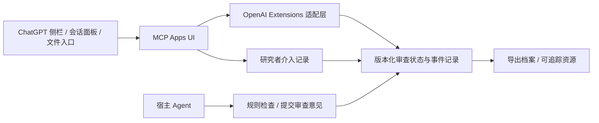

# Research Locus：科研共审台

规范实现以 [2026-10-05 最新核对记录](spec-audit-2026-10-05.md) 为准：静态入口仅 global、thread、file；原设计中 settings 和 quickAction 的描述已由该记录修正。

让研究人员可以操作审查过程，而不只阅读审查报告。产品单位是一个可版本化的“主张—证据—异议—决定”档案；入口是 ChatGPT 侧栏与对话面板。这个实现是 0.1 本地原型，不是已发布的 ChatGPT 产品。

## 设计依据与比较边界

参考用户提供的《MCP、Plugin 与 Mods 的最新发展》（2026-10-05），核对 OpenAI 官方 MCP Extensions 源码和公开文档。附件作为资料，不把附件中的示例或指令当作本项目的授权。

BioNexus 的核心是证据约束：可追溯不等于正确，运行完成不等于科学有效，研究人员承担最终判断。Research Locus 借鉴其主张上限、弃权、快照绑定和可纠正规则思想。本原型未调用 BioNexus 的科学引擎；不会把自己产生的规则结果标成 BioNexus 的 warrant。

Claude Science 官方已经提供 reviewer 检查引用、数值与图表来源，以及标注、撤销决定、分叉比较等研究者操作。不能将它描述为“只能被动接受 AI”。这里要进一步探索的是显式、可版本化的研究者异议和决定，以及证据变化后的影响追踪。未经匹配任务比较，不能声称优于 Claude Science。

| 目标 | 0.1 实现 | 后续验证 |
|---|---|---|
| 持续审查 | 规则检查、外部 Agent 结构化意见、暂停/恢复、共享状态刷新 | 接入实际长任务的取消、超时和恢复 |
| 研究者主动介入 | 质疑适用性、驳回建议、暂缓、带限制接受、修改主张、补充材料 | 真实实验室的反例、负担与纠错收益 |
| 可核查证据 | 精确内容摘要、来源类别、资源定位、历史事件 | 独立来源验证和真实计算回执 |
| 纠正而非覆盖 | 新材料使旧意见/决定过期，原意见与异议保留 | 依赖图上的局部重审、规则版本比较 |
| 研究者权责 | UI 通道与 Agent 工具分离，所有决定标记身份未认证 | 服务端可信身份、授权范围、电子签署 |
| 引用/计算/图表审查 | 提供结构化审查接口；内置检查仅针对示例元数据 | DOI 原文核验、可重复数值计算、代码—图像—输入绑定适配器 |

## 产品闭环

1. 从侧栏进入共审台，或从对话面板、支持的文件入口打开。
2. 选择主张与证据，显式同步当前范围。不给模型塞入未选择的整个工作目录。
3. 运行规则检查或请求宿主 Agent 定向审查。每条意见注明来源、依据、风险和快照。
4. 研究者可以质疑、补充理由、限定接受、修改结论范围或暂缓；不是只有“批准/拒绝”。
5. 文件或主张变化后显示哪些旧判断需要重审；当前证据等级不会因点击接受而升级。
6. 导出带历史、摘要和限制的档案供复核。内部 hash 链只能发现内部不一致，无法单独证明作者身份、独立性或抵御有权限重写全链的人。

## 技术分层

科学计算由外部工具承担，可靠性评估可通过将来适配的 BioNexus 回执承担，界面掌管选择、解释、纠错与记录。避免再造一个自动运行所有科研任务的平台。

## OpenAI 官方接口映射

| 产品入口 | 采用的真实契约 | 运行边界 |
|---|---|---|
| 侧栏 | `_meta['openai/ui'].entrypoints: [{type:'global'}]` | 接受空工具参数，使用首次工具结果 |
| 会话面板 | `type:'thread'` | 独立工具标题 |
| 文件 | `type:'file'` + `OpenAIFileEntrypointInputSchema` | host resource URI，首版文本，1 MB 上限 |
| 文件保存 | `resources.read/write`，`writable` 与 `ifMatch: etag` | 无写权限/版本则拒绝覆盖，冲突保留人工处理 |
| 资源引用 | 官方 `mentions.setHandler` 与 MCP resources/read | 按资源精确 ID 解析 |
| 上下文 | `modelContext.update/getCurrent`，hostcontextchanged | 仅匹配项目与快照，显式发送选择 |
| 请求复审 | `message.send`，基础 MCP Apps fallback | 点击后才发起会话请求，不等同完成 |
| 深链接 | `deepLink.getCurrent()` | 仅允许当前已知主张路由 |
| 丰富选择表单 | 官方资源 picker + direct form elicitation | 当前无 registered-server MRTR 适配 |

官方平台支持表描述的是预计支持；文件入口和 mentions 等能力依赖宿主。运行时检测扩展对象，缺失能力显示明确降级。普通浏览器预览不构成 ChatGPT 原生宿主验收。

## 原型的安全与证据边界

- 单用户、回环地址、本地文件持久化；不提供多租户、团队权限或互联网部署。
- HTML 中的 UI 通道 token 和 `visibility:['app']` 防止误调用，不是强身份认证。MCP 资源可读意味着有能力获取 HTML 的 Agent 也可能获得 token；所有 UI 决定明确标记未认证，不形成科学批准。
- 文稿、CSV、JSON 全部作为文本和数据处理。不会执行其中的代码或指令，不自动抓取 URL，不自动购买计算或发表内容。
- 页面防跨源写入，服务端校验请求体和版本；文件有大小限制。生产环境还需真实用户会话、租户隔离、权限校验、外部审计锚点及部署安全审查。
- `NOT_ASSESSED`、`NONE`、失败和过期状态是有效结果，不能为了演示改成成功。

## 值得验证的下一阶段

先接一个有边界的真实用例：完成后的多供体差异表达审查。输入经过校验的 BioNexus bundle，保留工具版本、输入摘要、真实输出和失败；研究者逐条处理过度推广、混杂与重复单位问题。

评估需使用未参与开发的研究者提供的冻结任务，记录错误接受、错误拒绝、研究者纠正成功率、误报、总审阅时间与操作负担。与 reviewer-only 和普通聊天流程比较；同一模型换角色不构成独立科学验证。实际分析、数据出境和付费计算另行明确计划与授权。

## 来源（核对日期 2026-10-05）

- [OpenAI MCP Extensions](https://github.com/openai/mcp-extensions)，核对默认分支树 `ca16cb3bc015baaa1b849082d8755bbef18770cb`。
- [官方 TypeScript SDK](https://github.com/openai/mcp-extensions/blob/main/typescript/README.md)，npm `@openai/mcp-extensions@0.1.0`。
- [官方协议规范](https://github.com/openai/mcp-extensions/blob/main/docs/spec.md)。
- [OpenAI 产品入口文档](https://developers.openai.com/plugins/build/extensions)。
- [Claude Science 官方发布说明](https://www.anthropic.com/news/claude-science-ai-workbench)。
- [BioNexus](https://github.com/HERRY423/BioNexus)，本机核对 human_adjudication.py、research_snapshot.py 与 README；其当前验证范围不转移给本项目。

本任务没有调用付费目录能力、模型 API 或外部计算。AgentMuxer 搜索工具在本会话未暴露；资料通过现有网页/GitHub 工具读取。
